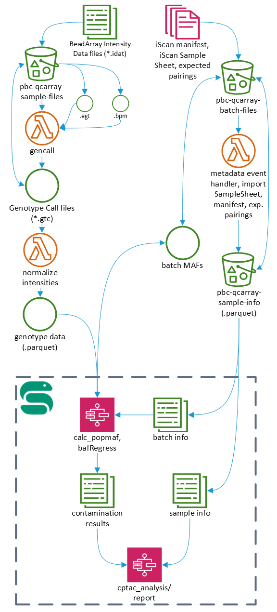

# pbc-iscan-qcarray
The Pathology and Biorepository Core at the Van Andel Research Institute uses the Illumina Infinium QC Array BeadChip on the Illumina iScan to check biospecimens for contamination and mislabling. 
This workflow has three main parts:
1. gencall - Generate Genotype Call files (.gtc) from BeadArray Intensity Data files (.idat)
2. metadata - Merge run/batch metadata from CSV/Excel into Apache Parquet column-oriented data files partioned by batch
3. QC - Determine sample contamination and mislabling, which consists of:
- popmaf - Calculate population frequencies for: (1) run/batch, (2) range of runs/batches, or (3) entire study/cohort
- [bafRegress](https://genome.sph.umich.edu/wiki/BAFRegress) - Contamination testing
- analysis - Perform the remaining QC analysis steps to determine sample mislabling

This first two parts of the workflow are implemented as AWS Serverless, event-driven processes. The last part of the workflow (QC) is implemented as a Jupyter notebook in R. See the [README](analysis/README.md) for that part.

 

## Prerequisites
The infrastructure code is currently a [SAM app](https://docs.aws.amazon.com/serverless-application-model/latest/developerguide/what-is-sam.html). You'll need to install the [AWS SAM CLI](https://docs.aws.amazon.com/serverless-application-model/latest/developerguide/serverless-sam-cli-install.html).
