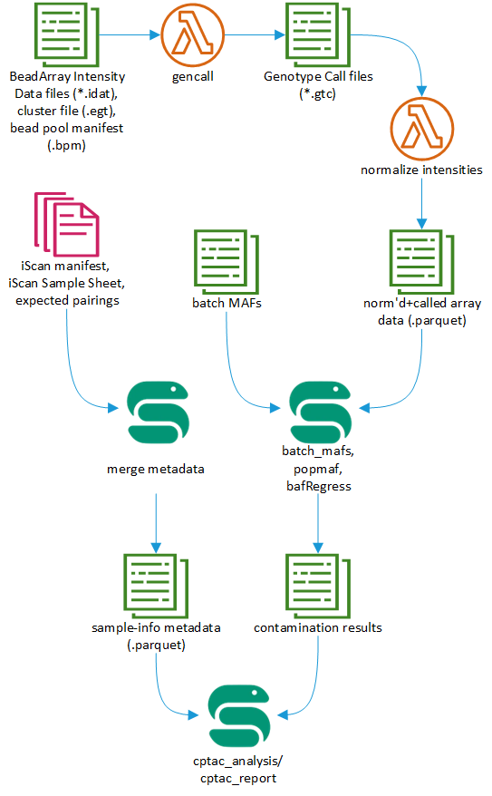

# pbs-iscan-qcarray
The Pathology and Biorepository Core at the Van Andel Research Institute uses the Illumina Infinium QC Array BeadChip on the Illumina iScan to check biospecimens for contamination and mislabling. 
This workflow has three main parts:
1. gencall - Generate Genotype Call files (.gtc) from BeadArray Intensity Data files (.idat).
2. metadata - Ingest run/batch metadata into DynamoDB via Microsoft Excel spreadsheets.
3. file API - Allow downstream steps in the workflow to download data in supported file formats.
4. analysis - Perform QC analysis steps to determine sample contamination and mislabling.

This repository contains the first three parts of the workflow, implemented as AWS Serverless processes. The last part of the workflow (analysis) can be found here: https://github.com/vari-bbc/cptac_workflow

 

## Prerequisites
The infrastructure code is currently a [SAM app](https://docs.aws.amazon.com/serverless-application-model/latest/developerguide/what-is-sam.html). You'll need to install the [AWS SAM CLI](https://docs.aws.amazon.com/serverless-application-model/latest/developerguide/serverless-sam-cli-install.html).
